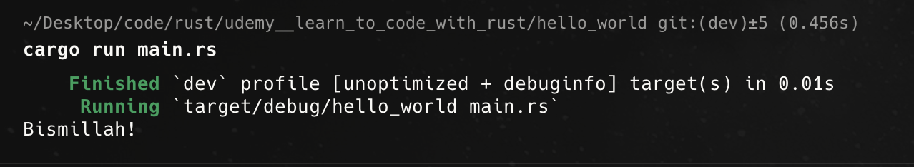
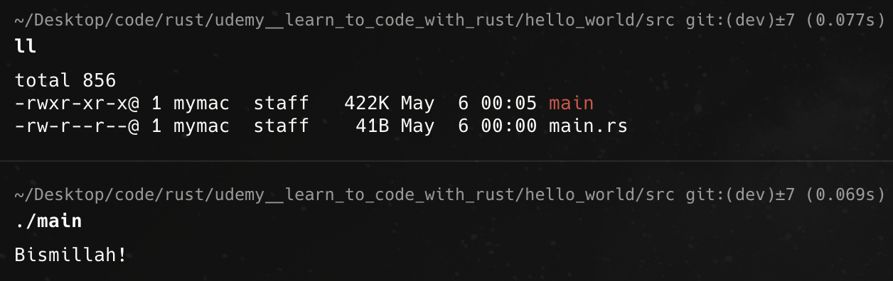
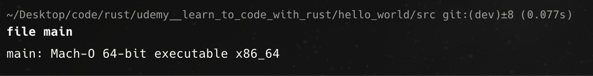

# Rust - Lear to code with Rust

Boris Paskhavar, New York

Rust -> System's programming language

System's rogramming -> refers to a category of languages that are optimized for situations where resources (memory and CPU) are limited

- Rust lang. design enables the speed of those lang. with added satbility and safety
- Build safe, fast and efficinet programs

## Rust Compiler

- translates the soucre code into an executable program (binary/binary executable)

## Syntax:

- Rust is among the strictest of them all. Every detils matters to the complier.

- case sensitivity matters
- space amtters
- symbols matters
- line breaks matter

## INstalling Rust on MacOS:

- visit rust-lang.org

- Using rustup (Recommended)
- curl --proto '=https' --tlsv1.2 -sSf https://sh.rustup.rs | sh

## Updating / Uninstallaing the rust

- rustup update
- rustup self uninstall

## Documentation

- rustup doc
- opens rust documentation file in the browser

# Create Rust project:

## Cargo:

- a command line tool that helps manage rust projects
- to create projects, to compile the executable programs from the source code
- recommended way to create a new rust project.

  - give nice starter template
  - enforces consistency across project

- project
- package
- crate

## create a rust project:

- cargo new project_name
  - snake_case are prefered

Output:
➜ udemy\_\_learn_to_code_with_rust git:(dev) ✗ cargo new hello_world
Creating binary (application) `hello_world` package
note: see more `Cargo.toml` keys and their definitions at https://doc.rust-lang.org/cargo/reference/manifest.html

## Binary crate vs Rust packages/crates/library crates

- binary crate:
  - a standaone rust application whose purpose is to be run bu itself in isolation
  - Eg: Car
- Rust packages/crates/library crates:

  - one that exists to be used in other projects / to be used else where
  - Eg: Tyre, Engine

- "cargo new" command used to create a binary crate, its own independednt application

## Project/Folder structure:

- Rust files wnds with .rs extension (Eg: main.rs)

- ### src folder
  - contains all rust code files.
  - Eg: main.rs file
- ### target folder
  - where the compiler place the executable that it builds from our source
  - it contains the final executable code
  -
- ### .gitignore file:
- ### Cargo.toml
  - includes info and metadata about the project.
  - TOML - Tom's Obivous marup language
  - It's a plain text file where we define keys and values (definitions as of now)
- ### Cargo.lock
  - it is automatically geenrated by Cargo whenerver we compile / build the final executable.
  - exists to keep track of the project dependencies

## Function:

- function is a collection/sequence of instructions to execute in order
- exisit for purpose of organization

- written in al lowercase - main function should be in lowercase
- main funciton is the entry point to the program
- rust automatically execute/call/invoke the main funciton - fn main() {}

## Parameter:

- an input to a funciton
- () - parantheses

## Run CMD:

- cargo run filename.rs/filename

## Compile CMD: - using rust compiler

- on the src folder:

  - rustc main.rs/filename
  - once done, a executable file will be created
    - executable filename in macOS: main
    - executable filename in windows: main.exe

- ## RUN a compiled executable file: in macOS/windows:

- in the src dir, enter ./main
- .\main.exe (for windows)

- ## to get a file analysis in macOS:

- .\main.exe
- 
